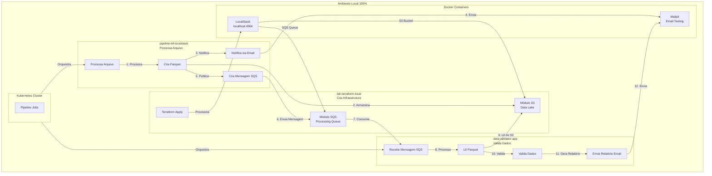

# lab-terraform-local

## 📋 Sobre o Projeto

O **lab-terraform-local** utiliza **Terraform** para automatizar a criação de infraestrutura AWS local usando **LocalStack** (Docker). A infraestrutura criada inclui recursos de **S3** (Data Lake) e **SQS** (filas de processamento), todos executando localmente sem nenhuma conexão externa ou custos.

Este projeto é responsável por **criar a infraestrutura** base para um pipeline ETL completo que inclui:

- **LocalStack** com AWSLocal CLI para emular serviços AWS
- **Mailpit** (Docker) para captura e visualização de emails
- **Kubernetes** para orquestração de jobs e pipelines
- **Terraform** (este projeto) para provisionamento automatizado da infraestrutura

## 🏗️ Arquitetura

O diagrama abaixo ilustra como este projeto se integra com os outros componentes do pipeline:



## 🎯 Objetivos

- ✅ Criar infraestrutura AWS local (S3 e SQS) sem custos
- ✅ Automatizar o provisionamento com Terraform
- ✅ Integrar com pipeline de jobs em Kubernetes
- ✅ Facilitar testes e desenvolvimento local
- ✅ Garantir ambiente 100% isolado e sem dependências externas

## 📦 Pré-requisitos

Antes de começar, certifique-se de ter instalado:

- **Docker** e **Docker Compose** (para LocalStack e Mailpit)
- **Terraform** >= 1.0
- **Kubernetes** (kubectl) - para integração com pipeline de jobs
- **AWSLocal CLI** (opcional, para interação direta com LocalStack)

## 🚀 Instalação e Configuração

### 1. Iniciar LocalStack

O LocalStack deve estar rodando na porta `4566`. Você pode iniciá-lo com:

```bash
docker run -d \
  --name localstack \
  -p 4566:4566 \
  -e SERVICES=s3,sqs \
  localstack/localstack
```

Ou usando Docker Compose (se disponível no seu ambiente):

```yaml
version: "3.8"
services:
  localstack:
    image: localstack/localstack
    ports:
      - "4566:4566"
    environment:
      - SERVICES=s3,sqs
```

### 2. Configurar Variáveis

Edite o arquivo `terraform.tfvars` com o nome do seu projeto:

```hcl
project_name = "seu-projeto"
```

### 3. Inicializar Terraform

```bash
terraform init
```

### 4. Revisar o Plano

```bash
terraform plan
```

### 5. Aplicar a Infraestrutura

```bash
terraform apply
```

## 📁 Estrutura do Projeto

```
lab-terraform-local/
├── main.tf                 # Configuração principal e provider AWS (LocalStack)
├── variables.tf            # Variáveis do projeto
├── outputs.tf             # Outputs da infraestrutura criada
├── terraform.tfvars        # Valores das variáveis
├── modules/
│   ├── s3/
│   │   ├── main.tf        # Recurso S3 Bucket
│   │   ├── variables.tf   # Variáveis do módulo S3
│   │   └── outputs.tf    # Outputs do módulo S3 (nome, ARN, região)
│   └── sqs/
│       ├── main.tf        # Recurso SQS Queue
│       ├── variables.tf   # Variáveis do módulo SQS
│       └── outputs.tf    # Outputs do módulo SQS (nome, ARN)
└── README.md              # Este arquivo
```

## 🔧 Módulos

### Módulo S3

Cria um bucket S3 para armazenamento de dados (Data Lake).

**Variáveis:**

- `bucket_name`: Nome do bucket
- `tags`: Tags aplicadas ao bucket

**Outputs:**

- `bucket_name`: Nome do bucket criado
- `bucket_arn`: ARN do bucket
- `bucket_region`: Região do bucket

### Módulo SQS

Cria uma fila SQS para processamento assíncrono de mensagens.

**Variáveis:**

- `queue_name`: Nome da fila
- `delay_seconds`: Delay em segundos antes de processar mensagens
- `retention_seconds`: Tempo de retenção das mensagens em segundos
- `tags`: Tags aplicadas à fila

**Outputs:**

- `queue_name`: Nome da fila criada
- `queue_arn`: ARN da fila

## 🔗 Integração com Outros Projetos

Este projeto Terraform é a base de infraestrutura para outros dois projetos que compõem o pipeline ETL completo:

### pipeline-etl-localstack

**Link:** [https://github.com/victorftrdba/pipeline-etl-localstack](https://github.com/victorftrdba/pipeline-etl-localstack)

**Responsabilidade:** Processar arquivos, criar arquivos Parquet, notificar via email e criar mensagens no SQS.

**Integração:**

- Processa arquivos de entrada
- Cria arquivos Parquet e armazena no bucket S3 criado por este projeto
- Envia notificações por email (capturadas pelo Mailpit)
- Publica mensagens na fila SQS após processamento
- Executa jobs no Kubernetes para orquestração

**Fluxo:**

1. Recebe arquivo para processamento
2. Processa e converte para formato Parquet
3. Armazena Parquet no bucket S3 (criado pelo lab-terraform-local)
4. Envia notificação por email via Mailpit
5. Publica mensagem na fila SQS (criada pelo lab-terraform-local)

### data-validator-app

**Link:** [https://github.com/victorftrdba/data-validator-app](https://github.com/victorftrdba/data-validator-app)

**Responsabilidade:** Receber mensagens do SQS local, ler o resultado do Parquet e enviar um email com relatório.

**Integração:**

- Consome mensagens da fila SQS criada por este projeto
- Lê arquivos Parquet do bucket S3 (criado pelo lab-terraform-local)
- Valida os dados processados
- Gera e envia relatório por email (capturado pelo Mailpit)
- Executa jobs no Kubernetes para processamento assíncrono

**Fluxo:**

1. Consome mensagem da fila SQS (criada pelo lab-terraform-local)
2. Lê arquivo Parquet do bucket S3 (criado pelo lab-terraform-local)
3. Valida os dados conforme regras de negócio
4. Gera relatório de validação
5. Envia relatório por email via Mailpit

## 🔄 Pipeline de Jobs

O fluxo completo do pipeline ETL funciona da seguinte forma:

### Fase 1: Provisionamento (lab-terraform-local)

1. **Terraform cria infraestrutura**
   - Cria bucket S3 no LocalStack para armazenar arquivos Parquet
   - Cria fila SQS no LocalStack para comunicação assíncrona
   - Infraestrutura fica disponível em `localhost:4566`

### Fase 2: Processamento ETL (pipeline-etl-localstack)

2. **Processamento de arquivos**
   - Recebe arquivo de entrada (via Kubernetes job)
   - Processa e converte para formato Parquet
   - Armazena Parquet no bucket S3 criado
   - Envia notificação por email (capturada pelo Mailpit)
   - Publica mensagem na fila SQS com informações do processamento

### Fase 3: Validação (data-validator-app)

3. **Validação de dados**
   - Consome mensagem da fila SQS (via Kubernetes job)
   - Lê arquivo Parquet do bucket S3
   - Valida dados conforme regras de negócio
   - Gera relatório de validação
   - Envia relatório por email (capturado pelo Mailpit)

### Fase 4: Orquestração (Kubernetes)

4. **Orquestração de jobs**
   - Kubernetes agenda e executa jobs do pipeline-etl-localstack
   - Kubernetes agenda e executa jobs do data-validator-app
   - Garante processamento assíncrono e escalável

### Fase 5: Monitoramento (Mailpit)

5. **Visualização de emails**
   - Todos os emails são capturados pelo Mailpit
   - Permite visualização e testes de emails sem envio real
   - Interface web para verificar notificações e relatórios

**Resultado:** Pipeline ETL completo executando 100% localmente, sem custos e totalmente isolado.

## 📊 Outputs do Terraform

Após executar `terraform apply`, você pode visualizar os recursos criados:

```bash
terraform output
```

Principais outputs:

- `data_lake_bucket_name`: Nome do bucket S3 criado
- `processing_queue_name`: Nome da fila SQS criada

## ✅ Benefícios do Ambiente Local

- **💰 Zero Custos**: Nenhum recurso AWS real é utilizado
- **🚀 Desenvolvimento Rápido**: Infraestrutura disponível instantaneamente
- **🔒 Isolamento Total**: Ambiente completamente isolado, sem dependências externas
- **🧪 Testes Seguros**: Teste pipelines completos sem riscos ou custos
- **🔄 Reproducibilidade**: Infraestrutura versionada e reproduzível com Terraform
- **📧 Teste de Emails**: Mailpit permite visualizar emails sem envio real

## 🛠️ Comandos Úteis

### Verificar recursos criados no LocalStack

```bash
aws --endpoint-url=http://localhost:4566 s3 ls
aws --endpoint-url=http://localhost:4566 sqs list-queues
```

### Destruir infraestrutura

```bash
terraform destroy
```

### Validar configuração Terraform

```bash
terraform validate
```

### Formatar código Terraform

```bash
terraform fmt
```

## 📝 Variáveis Principais

| Variável       | Descrição                                | Padrão                   |
| -------------- | ---------------------------------------- | ------------------------ |
| `project_name` | Nome do projeto (usado como prefixo)     | -                        |
| `region`       | Região AWS (apenas para compatibilidade) | `us-east-1`              |
| `common_tags`  | Tags comuns aplicadas aos recursos       | `Environment: Local-Dev` |

## 🔍 Verificação

Para verificar se tudo está funcionando:

1. LocalStack rodando: `curl http://localhost:4566/_localstack/health`
2. Bucket criado: `aws --endpoint-url=http://localhost:4566 s3 ls`
3. Fila criada: `aws --endpoint-url=http://localhost:4566 sqs list-queues`

## 📚 Recursos Adicionais

- [LocalStack Documentation](https://docs.localstack.cloud/)
- [Terraform AWS Provider](https://registry.terraform.io/providers/hashicorp/aws/latest/docs)
- [Mailpit Documentation](https://github.com/axllent/mailpit)

## 👤 Autor

**Victor Nogueira** - [@victorftrdba](https://github.com/victorftrdba)

## 📄 Licença

Este projeto é parte de um ambiente de desenvolvimento e testes local.

---

## 📦 Projetos Relacionados

Este projeto faz parte de um ecossistema de três projetos que trabalham juntos:

1. **[lab-terraform-local](https://github.com/victorftrdba/lab-terraform-local)** (este projeto)

   - Responsável por criar a infraestrutura (S3 e SQS)

2. **[pipeline-etl-localstack](https://github.com/victorftrdba/pipeline-etl-localstack)**

   - Responsável por processar arquivos, criar Parquet, notificar via email e criar mensagens no SQS

3. **[data-validator-app](https://github.com/victorftrdba/data-validator-app)**
   - Responsável por receber mensagens do SQS, ler Parquet e enviar relatório por email

**Nota:** Certifique-se de ter todos os três projetos configurados para um pipeline completo funcionando.
